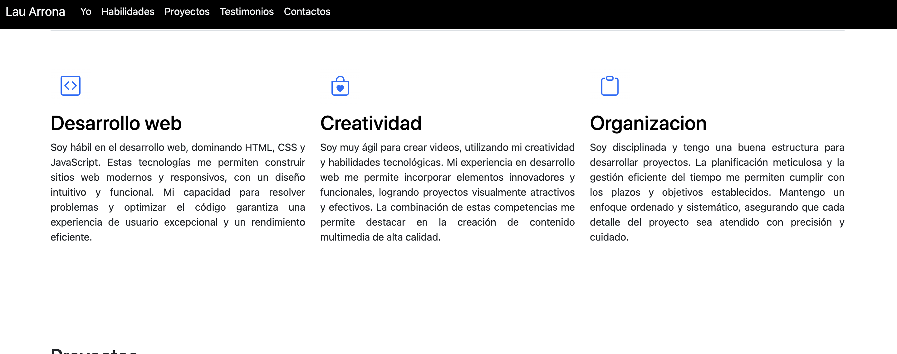
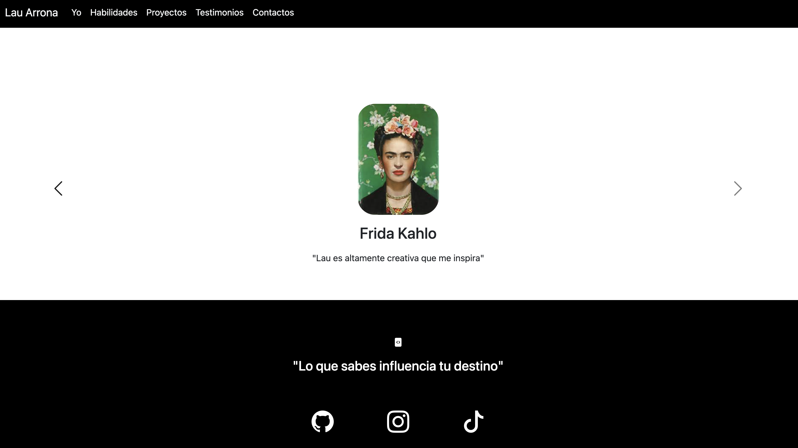

# Mi portafolio de habilidades TECNOLOCHICAS PRO 💜
El presente proyecto es un portafolio desarrollado para poner en práctica las habilidades obtenidad dentro del bootcamp de desarrollo frontend de Technolochicas PRO.
Fue desarrollado con HTML, CSS y JS con el uso de el framework de UI, Bootstrap utilizando además bibliotecas externas.
La página es responsiva (adaptable a diferentes tamaños de pantalla) e incluye la presentación de la autora del proyecto.

[Proyecto desplegado (https://keen-pastelito-0f487f.netlify.app/)](https://keen-pastelito-0f487f.netlify.app/)
<!-- cambiar link -->

## Secciones de mi sitio

## Tecnologías
* HTML
* CSS
* Bootstrap 
* Javascript
---
Desarrollado con  💜 por [Lau Arrona](https://malinali.dev/) en [TECHNOLOCHICAS PRO](https://tecnolochicas.mx/)
<!-- cambiar link -->

